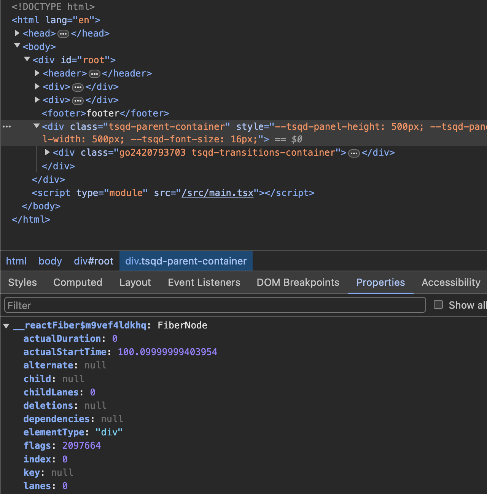

# 가상돔과 리액트 파이버

> 📚 이번 장에서는 가상돔은 왜 만들어졌을까, 실제 돔과의 차이, 실제 돔 조작 속도와의 비교에 대해 살펴 보자!
> 🌟 KEY POINTS : 가상 돔이 뭔지, 실제 돔과 비교한 이점, 가상 돔 다룰 때 조심할 점!

<details>

<summary> 1. DOM이란? 브라우저 렌더링 과정이 어떻게 되나요?  </summary>


```
DOM (document object model)은 웹페이지의 콘텐츠와 구조를 어떻게 보여줄지에
대한 정보를 담고 있는 웹페이지에 대한 인터페이스입니다.

브라우저 렌더링 과정에 도달하기 위해서,

1. 먼저 브라우저는 사용자가 요청한 주소를 뱡몬해 HTML 파일을 다운로드합니다.

2. 그 후 렌더링 언진은 HTML을 파싱해 DOM 노드로 구성된 트리인 DOM 트리를 생성합니다.

3. DOM 트리를 생성 중에 CSS 스크립트 요청이 있다면 DOM 트리 생성을 중단하고,
CSS 파싱을 하여 CSS노드로 구성된 CSSSOM을 생성합니다.

4. 브라우저는 생성했던 DOM 트리 노드 중 화면에 보일 요소에 해당되는 노드들을 (즉, display:none과 같은 요소들은 방문하지 않음) 순회하면서 CSSOM을 바탕으로 스타일을 입히는 작업을 합니다.

이 과정에서는 두가지가 있습니다.

   1) 레이아웃(reflow/layout) : 노드들이 브라우저 화면의 어느 좌표에 있는 지
                              정확히 계산합니다. 이 과정이 있다면 반드시
                              페인팅 작업도 수반됩니다.
   2) 페이팅(painting/resterizing) : 레이아웃 이후 색상 정보 등을 반영하여 그려줍니다.


```

예를 들어보면 다음과 같은 과정을 통해 렌더링이 발생합니다.

```css
/** ./style.css 파일 */
#text {
  background-color: red;
  color: white;
}
```

```html

<!DOCTYPE html>
<html>
  <head>
    <link rel="stylesheet" type="text/css" href="./style.css"/>
    <meta name="viewport" content="width=device-width,initial-scale=1" />
    <title>Critial Path: Hello world!</title>
  </head>
  <body>
    <div style="width: 10%">
      <div id="text" style="width: 50%">Hello world!</div>
    </div>
  </body>
</html>
```

1. 2위의 HTML을 브라우저가 다운로드하여 분석합니다.
2. 스타일시트가 포함된 link 태그를 발견하고, style.css를 다운로드 하고 CSSOM을 생성합니다.
3. body 태그 하단의 div는 넓이가 50%이므로 뷰포트 기준 좌우 너비를 100%으로 잡습니다.
4. 그 아래의 div는 넓이가 50%이므로 상위 태그 기준으로 너비를 50%으로 잡습니다.
5. 눈에 보이는 요소들을 파악했으므로 2에서 생성했던 CSSOM 정보를 반영하는데, id='text'의 배경은 빨강, 폰트색은 흰색으로 입힙니다.

](https://web.dev/static/articles/critical-rendering-path/render-tree-construction/image/calculating-layout-inform-93e78448ce474_1920.png)

</details>

<details>

<summary> 2. 가상돔 만드는 과정 (ft. react fiber)</summary>

```
가상돔 생성과 렌더링 최적화를 담당하는 역할은 react fiber가 합니다.
react fiber란 리액트에서 파이버 재조정자(fiber reconciler)가 관리하는 객체입니다.

파이버 재조정자는 실제 돔과 가상돔 간의 변경 사항을 수집하고,
변경 사항을 갖고 있는 파이버를 기준으로 화면에 렌더링을 요청합니다.
재조정(reconcilation)이란 새롭게 렌더링 해줘야 할 가상돔과 실제 돔을 비교하는 알고리즘입니다.

파이버는 변경 사항을 반응성있게 대처하기 위해서는 비동기적으로
작업을 작은 단위로 분할하고 쪼갠 다음 우선 순위를 매길 수 있고,
작업들을 일시 중지하고 다시 시작할 수 있고,
이전 했던 작업을 재사용하거나 필요없는 작업을 페기할 수 있어야 헙니다.

과거 리액트의 조정 알고리즘은 스택 알고리즘을 활용했기 때문에
작업들이 동기적으로 이루어졌고, 하나의 작업을 처리해야만 다른 작업으로 넘어갈 수
있었기 때문에 비효율적이었습니다.
즉, 파이버 트리를 생성/업데이트하는 작업이 동기적으로 일어나기 때문에 하나의 트리를 완성해야만 했습니다.

반면 현재의 파이버 트리와 workInProgress 파이버 트리 간의 업데이트를
비동기적으로 처리할 수 있습니다. 즉, 우선 순위가 높은 업데이트가
오면 업데이트 작업을 일시중단하거나 새롭게 만들거나, 폐기할 수 있습니다.
따라서 애니메이션이나 사용자 입력값 등의 처리는 우선 순위가 높은 작업으로 분류하고,
리스트 렌더링 등의 작업은 낮은 작업으로 분류하여 최적의 순위로 작업 수행이 가능해졌습니다.

파이버는 하나의 작업 단위로 구성돼어 있습니다.
하나의 작업 단위를 처리하면 finishedWork()라는 작업으로 마무리하고,
이 작업을 커밋해 실제 브라우저 DOM에 가시적인 변경 사항을 만듭니다.

렌더 단계에서 리액트는 사용자에게 노출되지 않는 비동기 작업을 수행합니다.
이 때 비동기적으로 우선순위를 지정하거나 중지시키거나 버리는 작업들을 합니다.

실제 변경 사항을 반영하는 단계인 커밋 단계에서는 돔에 commitWork()가 실행됩니다.
이 과정은 동기적으로 이루어지며 중단될 수 없습니다. 커밋 단계에서는 리액트 파이버 트리 간의 교체가 발생하는데,
이 때 더블 버퍼링 기술이 사용됩니다. 즉, 현재 파이버 트리와 변경사항을 반영하여 그린 파이버 트리의 포인터를 변경하여
현재 모습을 변경이 완성된 트리로 바꿔치기합니다.

파이버와 파이버 트리의 작동 흐름을 살펴보자면, 일반적인 파이버 노드는 다음과 같은 방식으로 셍상됩니다.

1. 리액트는 beginWork() 함수를 실행해 파이버 작업을 수행합니다. 더 이상 자식이 없는 파이버를 만날 때까지 트리형식으로 시작합니다.
2. 자식이 없고 작업이 끝난다면 completeWork() 함수를 실행해 파이버 작업을 완료합니다.
3. 형제가 있다면 형제로 넘어가며, 다시 beginWork()과 completeWork() (1과 2의 과정)을 수행합니다.
4. 모든 작업이 끝나면 return으로 돌아가 자신의 작업이 끝났음을 알립니다.

예를 살펴보자면 다음과 같습니다.        - 파이버 트리
                                ____                          -------------------
<A1>                            Root                          |   ↓ child       |
  <B1>hi</B1>                   ⎺⎺⎺⎺                          |   ↑ , ←  return |
  <B2>                          ↓  ↑                          |   → sibling     |
    <C1>                        ____                          -------------------
      <D1/>               ==>    A1  ←-----------
      <D2/>                     ⎺⎺⎺⎺             |
    </C1>                       ↓  ↑             |
  </B2>                         ____    ____    ____
  <B3/>                          B1  →   B2  →   B3
</A1>                           ⎺⎺⎺⎺    ⎺⎺⎺⎺    ⎺⎺⎺⎺
                                        ↓  ↑
                                        ____
                                         C1  ←---
                                        ⎺⎺⎺⎺     |
                                        ↓  ↑     |
                                        ____    ____
                                         D1  →   D2
                                        ⎺⎺⎺⎺    ⎺⎺⎺⎺

1. 먼저 A1에서 beginWork()가 수행되고,
2. 자식이 있으므로 B1으로 이동해 beginWork()가 수행됩니다.
3. B1자식이 없으므로 completeWork() 함수를 수행하고, 형재인 B2로 넘어갑니다.
4. B2에서 beginWork()를 수행하고, 자식 노드가 있으므로 C1으로 이동합니다.
5. C1에서 beginWork()를 수행하고, 자식 노드 D1으로 이동합니다.
6. D1에서 beginWork()를 수행하고, 자식 노드가 없으므로 completeWork() 함수를 수행하고, 형재인 D2로 넘어갑니다.
7. D2에서 beginWork()를 수행하고, 자식 노드가 없으므로 completeWork() 함수를 수행하고, 더이상 형제 노드도 없기 때문에
위로 올라가며 D1, C1, B2 순으로 completeWork() 함수를 호출합니다.
8. B2의 형제 노드인 B3에서 beginWork()를 수행하고, 자식노드가 없기 때문에 completeWork() 함수를 수행합니다.
9. B2까지 completeWork() 함수를 수행하면 반환해 상위로 타고 올라가고, A1의 completeWork() 함수를 수행합니다.
10. 루트 노드가 완성되면 최종적으로 completeWork() 함수를 수행하고,
변경 사항을 비교하여 업데이트가 필요한 변경 사항이 DOM에 반영됩니다.

파이버 트리가 생성된 후, setState 등으로 업데이트가 발생하면
앞서 만든 current 파이버 트리를 기반으로 현재 setState으로 인한 업데이트 요청을 받아 workInProgress 트리를 빌드합니다.
최초 렌더링에는 파이버를 처음부터 만들어야 하지만,
변경 사항을 반영할 때는 최초 렌더링 시 생성했던 파이버를 재사용하고 업데이트한 props를 내부적으로 처리합니다.

```



```js
// 파이버는 일반적인 객체 모습을 띠는 구나. 다만 child, sibling이 있다는 걸 보면 트리 형태
function FiberNode(tag, pendingProps, key, mode) {
  // Instance
  this.tag = tag;
  this.key = key;
  this.elementType = null;
  this.type = null;
  this.stateNode = null;

  // Fiber
  this.return = null;
  this.child = null;
  this.sibling = null;
  this.index = null;
  this.ref = null;
  this.refCleanup = null;

  this.pendingProps = pendingProps;
  this.memoizedProps = null;
  this.updateQueue = null;
  this.memoizedState = null;
  this.dependencies = null;

  this.mode = mode;

  // Effects
  this.flags = Noflags;
  this.subtreeFlags = Noflags;
  this.deletions = null;

  this.lanes = NoLanes;
  this.childLanes = NoLanes;

  this.alternate = null;

  /** 프로파일러 __DEV__ 코드 생략 */
}

// 생략..

// Fiber 생성 함수, 파이버와 element는 1:1
function createFiberFromElement(element, mode, lanes) {
  var owner = null;
  {
    owner = element.owner;
  }
  var type = element.type;
  var key = element.key;
  var pendingProps = element.pendingProps;
  var fiber = createFiberFromTypeAndProps(
    type,
    key,
    pendingProps,
    owner,
    mode,
    lanes
  );

  {
    fiber._debugSource = element._source;
    fiber._debugOwner = element.owner;
  }
  return fiber;
}

function createFiberFromFragment(elements, mode, lanes, key) {
  var fiber = createFiber(Fragment, elements, key, mode);
  fiber.lanes = lanes;
  return fiber;
}
```

</details>

<details>

<summary> 3. 리액트 파이버의 주요한 속성들?</summary>

```

리액트의 주요 속성들 중에는 tag, stateNode, child/sibling/return, pendingProps, memoizedProps, memoizedState,
alternate 등이 있습니다.

- tag: 파이버를 만드는 함수 createFiberFromElement에서 파이버와 element가 1:1
관계로 매칭되기 위한 정보를 담고 있는 속성. tag는 리액트 컴포넌트일 수도, HTML DOM 노드 일 수도 있고 아래의 코드의 값들을 가질 수 있습니다.
예를 들어, HostComponent는 div와 같은 요소입니다.

- stateNode: 파이버 자체에 대한 참조 정보를 지닌 속성. 리액트는 stateNode를 활용해 파이버와 관련 상태에 접근합니다.

- child,sibling,return : 파이버 간의 관계 개념에 관한 속성입니다.
리액트 컴포넌트가 트리 형태인 것처럼 파이버도 트리 형태를 띠는데, 이 속성들을 바탕으로 파이버 트리를 형성합니다.
파이버 트리는 리액트 컴포넌트와는 다르게 children 이 없고 child가 있습니다.
파이버의 child는 children 중 첫 요소를 갖고, 요소들의 sibling은 다음 child 요소와 return은 부모 요소,
그리고 자신이 sibling(형제 노드)들 간에서 몇 번째 인지를 나타내는 index를 갖고 있습니다.

파이버가 자식 관계를 나타내는 방식은 다음과 같습니다.

  <ul>
    <li>사과</li>                            const li_banana = {
    <li>딸기</li>                     ===>      return: ul,
  <li>바나나</li>                               index:2
  </ul>                                     }
                                            const li_strawberry = {
                                              sibling:li_banana
                                              return: ul,
                                              index:1,
                                            }
                                            const li_apple = {
                                              return: ul,
                                              index: 0,
                                              sibling: li_strawberry
                                            }

                                            const ul = {
                                              // .. 생략
                                              child: li_apple
                                            }

- pendingProps: 아직 작업을 미처 처리하지 못한 props
- memoizedProps: pendingProps을 기준으로 렌더링 완료 이후에 pendingProps를 memoizedProps로 저장해 관리
- updateQueue:상태 업데이트, 콜백함수, DOM 업데이트 등 필요한 작업을 담아두는 큐

  type UpdateQueue = {
    first: Update| null;
    last: Update|null;
    hasForceUpdate: boolean;
    callbackList:null | Array<Callback> // setState으로 넘긴 콜백 목록
  }

- memoizedState: 함수 컴포넌트의 훅 목록들을 담고 있는 속성, useState뿐만 아니라 모든 훅 리스트가 저장됩니다.
- alternate : 리액트에서는 변경 사항을 반영하기 위해 두개의 트리를 갖고 있습니다.
  변경될 모습을 그리고 있는 작업 중인 트리와, 현재 모습의 트리가 있는데, alternate은 반대편 트리 파이버를 가리킵니다.

```

```js
var FunctionComponent = 0;
var ClassComponent = 1;
var IndeterminateComponent = 2;
var HostRoot = 3;
var HostPortal = 4;
var HostComponent = 5;
var HostText = 6;
var Fragment = 7;
var Mode = 8;
var ContextConsumer = 9;
var ContextProvier = 10;
var ForwardRef = 11;
var Profiler = 12;
var SuspenseComponent = 13;
var MemoComponent = 14;
var SimpleMemoComponent = 15;
var LazyComponent = 16;
var IncompleteClassComponent = 17;
var DehydratedFragment = 18;
var SuspenseListComponent = 19;
var ScopeComponent = 20;
var OffscreenComponent = 21;
var LegacyHiddenComponent = 22;
var CacheComponent = 23;
var TracingMarkerComponent = 24;
```

</details>

<details>

<summary> 4. 파이버 트리에 대해서 알고 계시나요? 더블 버퍼링이 파이버 트리에 어떻게 사용되나요?</summary>

```
리액트 파이버는 요소의 UI 정보를 지닌 객체입니다. 재조정자는 파이버의 상태를 살펴 UI를 변경하는데, 파이버 트리는 이 파이버들로 구성된 트리입니다.
리액트에는 두개의 파이버 트리가 있는데, 하나는 현재 모습을 담고 있는 파이버이며, 다른 하나는 작업 중인 상태를 나타내는 workInProgress 트리입니다.

리액트 파이버의 작업이 끝나면 리액트는 포인터만 변경하여 workInProgress 트리를 현재 트리로 변경하는데, 이를 "더블 버퍼링"이라고 합니다.

더블 버퍼링은 UI 변경을 처리할때 한번에 모든 처리를 마치지 못해 미완성의 화면을 보여주는 대신,
다른 곳에서 변경될 모습을 미리 그린 다음, 완성되었을 때 현재 모습을 미리 그린 그림으로 바꿔치는 기술입니다.
리액트에서도 불완전한 트리를 노출하지 않기 위해서 더블 버퍼링 기법을 사용합니다.

아래와 같이 모든 작업은 current를 기준으로 합니다.
변경 사항이 발생하면 파이버는 리액트에서 새로 받은 데이터를 새로운 workInProgress 트리를 빌드하기 시작하고,
빌드를 완료하면 다음 렌더링에 이 트리를 사용하고, workInProgress 트리가 UI에 최종적으로 렌더링되어 반영되면
current가 이 workInProgress가 됩니다.

```


</details>

## 💭 TMI

> debunking the myth...가상돔이 브라우저가 일반 돔을 관리하는 것보다 빠르진 않구나. 다만 애플리케이션이 돌아갈만큼 괜찮은 정도!<br/>
> 리액트 내부 코드에 작성돼 있는 파이버 객체(FiberNode)를 보니까, 진짜 일반적인 객체구나. 즉 리액트는 UI를 값으로 관리하는 역할을 해주고, 이런 값들을 활용해 dom 변경 관리를 하는 거.<br/>
> 00_intro에서 리액트는 state값이 변경되었는지 확인할 때 depth1까지만 비교한다고 했었는데, 재조정자가 작업하는 방식을 보면 모든 depth 확인하는 건 성능 이슈있을 듯해서 이해가 간다.<br/>
> 리액트 요소와 파이버가 유사한 거 같지만<br/>
> 리액트 요소는 렌더링이 발생할 때마다 새롭게 생성!<br/>
> 파이버는 가급적이면 재사용됨! 즉, 컴포넌트가 최초로 마운트 되는 시점에 생성되고, 가급적이면 재사용됨!
